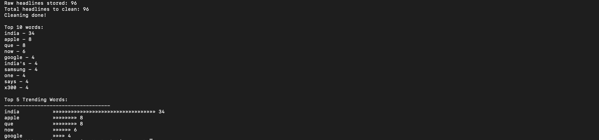

# News Trend Analyzer

A Python data pipeline built as a capstone project for the 
Python for Everybody specialization.

## What it does
- Fetches live news headlines using NewsAPI (urllib + JSON)
- Stores raw headlines in SQLite database
- Cleans and filters words (stopwords removal)
- Analyzes word frequency
- Displays top 5 trending words as a terminal bar chart

## Project Structure
fetch_news.py → clean_data.py → analyze.py → main.py

## How to Run
## Sample Output

## Skills Used
- urllib, json, ssl
- SQLite3
- String cleaning, regex
- Data pipeline design
